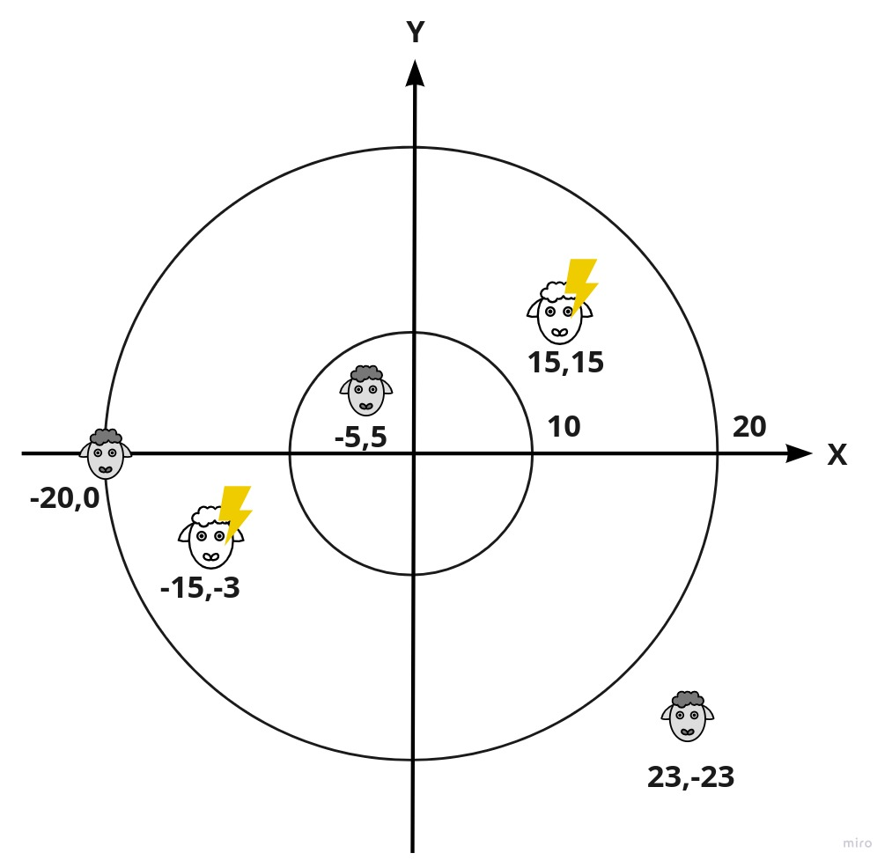

# `geofenceRing`

## Description

This is a simplified example of a
[virtual geofence](https://www.nordicsemi.com/News/2018/03/Nofence-collar-employs-nRF52832-to-provide-wireless-connectivity-with-beacons)
used to constrain animals to a specific area without the need to set up a
physical fence.

The main goal is to implement the function [`geofenceRing()`](./geofenceRing.ts) so
that it returns the number of sheep that are _inside_ the ring (the ring border
does not count).

In the example above, the ring inner circle has a diameter of 10 and the outer a
diameter of 20.

Sheeps positions are given as X and Y coordinates relative to the center of the
ring, and are at:

1. `15,15`
1. `-5,5`
1. `-20,0`
1. `-15,-3`
1. `23,23`

Only two sheeps are inside the ring: `15,15` and `-15,-3`.

## Architecture

For the exclusion of the edge case there is the `validateInput()` function, which is called in this cases:

1. If `inner` radius is bigger or equal with `outer` radius.
2. If `inner` or `outer` radius are smaller than zero.
3. If `pointsX` array has different length than `pointsY`.

After rejecting the inacceptable cases I am looping and pushing the distance of every sheep from (0,0) with the `distance([pointsX[i], pointsY[i]])` to an empty array named `distance`. Then after filtering the `distance` with the condition that value should be biggen from inner and smaller from outer. In the end I am just returning the length of the filtered distances.
