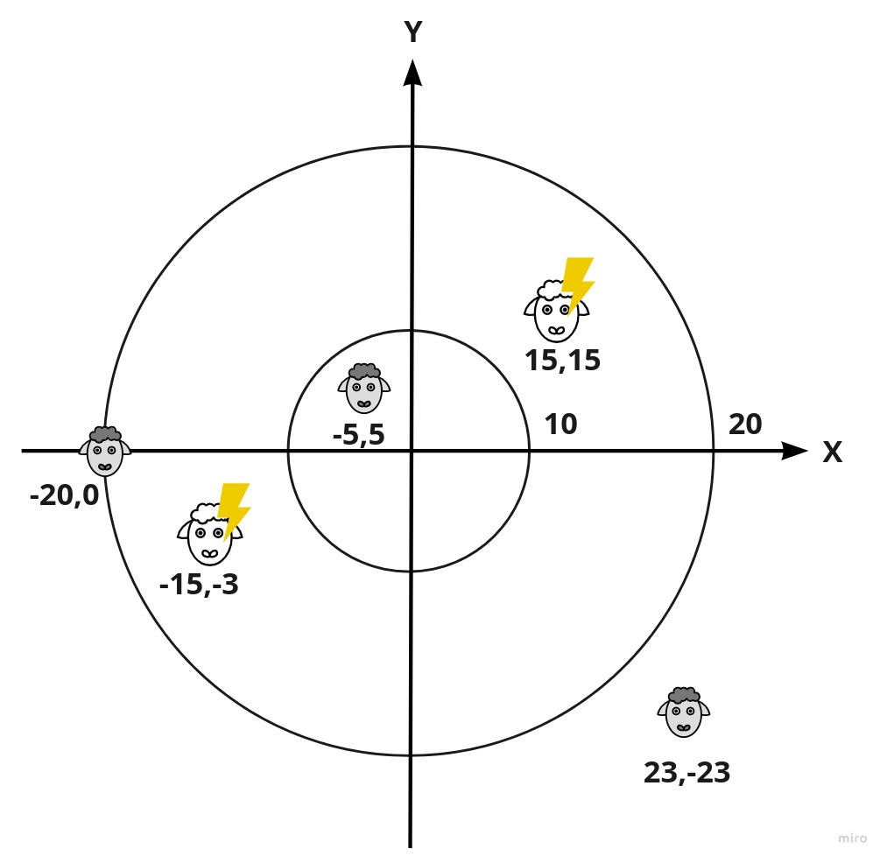

# geofence-ring

My TypeScript solution to a coding challenge: count how many points fall
**inside** a ring-shaped geofence, excluding the ring borders.



## The problem

A ring is defined by an `inner` and an `outer` radius, centred at the origin.
Given point coordinates as parallel `pointsX` / `pointsY` arrays, return how many
points lie strictly between the two radii. A point exactly on either border does
**not** count.

```ts
geofenceRing({ inner, outer, pointsX, pointsY }): number
```

## My approach

- `distance([x, y])` returns the Euclidean distance of a point from the origin
  (`Math.sqrt(a² + b²)`), defaulting the second point to `[0, 0]`.
- `geofenceRing()` maps every point to its distance, then keeps only those with
  `distance > inner && distance < outer` (strict comparisons exclude the border),
  and returns the count.
- `validateInput()` rejects a malformed ring where `inner >= outer`.

The implementation lives in [`geofenceRing.ts`](./geofenceRing.ts); the behaviour
is pinned by [`geofenceRing.spec.ts`](./geofenceRing.spec.ts).

## Run the tests

```bash
npm install
npm test
```

**Built with:** TypeScript, Jest and ts-jest.

## About

My solution to a take-home coding challenge.
